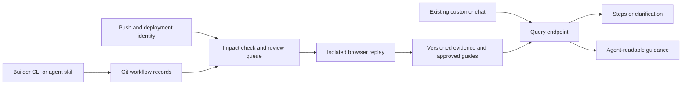

# Runtime architecture

[简体中文](ARCHITECTURE.zh-CN.md)

The local alpha implements a single HTTP process with a bounded browser queue,
atomic JSON state and private artifacts. The hosted pilot runs the same service
with a remote mirror for the legacy workflow state; module records still need a
hosted durable adapter before production certification. See
[operations](OPERATIONS.md) for supported configuration and current limits.

## Data and relationships

Use stable IDs and adjacency lists in ordinary JSON, not a graph database. Nodes: source file, screen, workflow, step, verification run, published guide. Edges: source affects screen, step uses screen, workflow contains step, run verifies workflow, guide cites run. Store the provenance of each edge: authored or inferred, source revision and reviewer. Inferred links remain candidates until reviewed; graph reach reports potential impact, not runtime truth.

The workflow is a semantic record. Browser selectors and provider tool calls live in adapters; customer steps describe intent, target meaning and expected outcome. Screenshots are evidence assets, not authority to execute instructions embedded in an image.

## Freshness state

Draft → needs review → verified for environment/version → published for matching deployment. A failed or expired run is ineligible for new current answers. A new commit creates candidate records rather than replacing the guide for an older deployed release. A publication key includes application, deployment version, role/plan context, locale and relevant feature flags.

Evidence holds exact commit and deployment identity, environment, runner version, time, role, step assertions and artifact digest. Unknown deployment identity cannot yield a verified current answer. TTL is configurable; feature-flag or permission changes can invalidate a guide even without a source push.

## Work scheduling

A push only schedules impact work. A deployment/preview-ready signal enables replay; use idempotency keyed by workflow revision and environment identity. Coalesce repeated pushes and cancel superseded jobs. An optional nightly check catches runtime drift. Queue missing semantic facts for the builder in a digest rather than interrupting every edit.

Capture, impact assessment, verification and questioning are responsibilities; they do not require separate always-on agents. Start with deterministic code and narrowly scoped model calls. Introduce multiple agents only when measured quality or throughput demands it.

## Browser boundary

Disposable browser context, seeded account, allowlisted origin, finite time/action budget and cleanup on success/failure/cancellation. Initially run trusted projects locally or in an operator-provided container. Browser contexts isolate cookies, not hostile application code or networks; executing untrusted customer projects requires stronger container/VM and network isolation before support is claimed.

Deny arbitrary navigation and private-network fetches from user-supplied URLs. Read an image by an authorized artifact ID; do not let screenshot URLs become an SSRF channel. Never run customer-provided scripts. Keep billing, messages, deletion and real customer mutations outside Stage 1 replay.

## Integration boundaries

Shared CLI + skill instructions first; host-specific plugins are packaging around the same domain model. Claude Code plugins can package skills/hooks; pi offers extensions; verify the exact Codex integration surface at implementation time. Do not assume identical hook names or MCP support across all hosts.

MCP can expose tools/resources to compatible hosts; it does not standardize a universal click/keyboard action schema. FlowWitness's guidance format is a proposal, not a computer-use standard. Future adapters must translate to a host's actual capability model and preserve customer consent. The query API never grants permissions to a customer's machine.

## Reuse

Archify is an optional future visualization target for explicit authored relationships and evidence references. Its validation is diagram validation, not browser verification. Stagehand can help interpret UI targets; Playwright assertions establish observable outcomes. Neither proves that a different account or deployment has the same behavior.

See [research](RESEARCH.md) for primary sources and [API](API.md) for the initial interface proposal.
