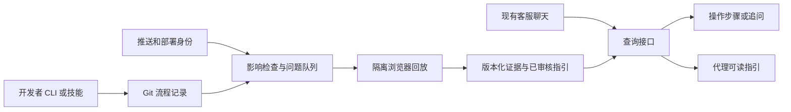

# 运行时架构

[English](ARCHITECTURE.md)

本地 alpha 已实现 HTTP 服务、有限浏览器队列、原子 JSON 状态与私密资源。运行方式与限制见 OPERATIONS.zh-CN.md。

## 数据与关系

以稳定 ID 和普通 JSON 邻接关系记录源文件、页面、流程、步骤、验证运行及已发布指引。边表示源文件影响页面、步骤使用页面、流程包含步骤、运行验证流程、指引引用运行。每条关系保留人工或推断来源、版本与审核记录。推断关系先作为候选，不把图的可达性称作实际故障证据。无需图数据库。

流程描述语义；选择器和具体工具调用留在适配器。截图是证据，不是执行截图中文字指令的授权。

## 新鲜度与发布

草稿 → 待审核 → 指定环境/版本验证通过 → 绑定对应部署发布。失败、过期的证据不能产生新的当前答案。新提交创建候选记录，不替换旧部署自己的指引。发布键包括应用、部署版本、角色/套餐、语言和相关功能开关。

记录精确提交、部署身份、环境、执行器版本、时间、角色、断言及资源摘要。部署身份未知就不能输出“当前已验证”。证据寿命可配置；权限和开关变化不一定伴随代码推送。

## 调度与询问

推送只安排影响检查。预览就绪或部署事件决定何时回放。以流程版本与环境身份做幂等键，合并连续推送，取消被取代的任务；可选夜间检查捕获运行时漂移。对缺失事实按版本去重并集中询问。

捕获、影响判断、验证和提问是职责，不必各自部署常驻代理。先用确定性代码和小范围模型调用，出现实际质量或吞吐瓶颈后再增加代理。

## 浏览器边界

一次性浏览器上下文、种子账号、允许的来源、有限动作/时间预算，成功失败取消都清理。浏览器上下文隔离 Cookie，但不等于隔离恶意代码和网络；不可信项目需要容器/虚拟机及网络隔离后才能声明支持。

不得随意访问用户 URL 或内网；通过有权限的资源 ID 读图片，防止 SSRF。不能执行客户脚本。付款、发消息、删除和真实客户数据修改不进入第一阶段回放。

## 接入边界与复用

先共享 CLI 与技能说明，再包装不同宿主插件。Claude Code、Codex、pi 的事件、扩展和权限接口必须分别核实；不能假设它们具有同名钩子或相同 MCP 能力。

MCP 可以传递工具和资源，但不定义通用点击/键盘方案。FlowWitness 的结构化指引是项目提案，不是行业标准。未来适配器要转换成真实宿主能力，并保留用户授权；查询接口不授予操作用户电脑的权限。

Archify 可用于未来的关系可视化。它验证图表，不验证用户任务。Stagehand 可解释界面目标，Playwright 断言检查可观察结果；二者都不能保证另一账号或部署行为相同。来源见 [调研](RESEARCH.zh-CN.md)，接口见 [API](API.zh-CN.md)。
